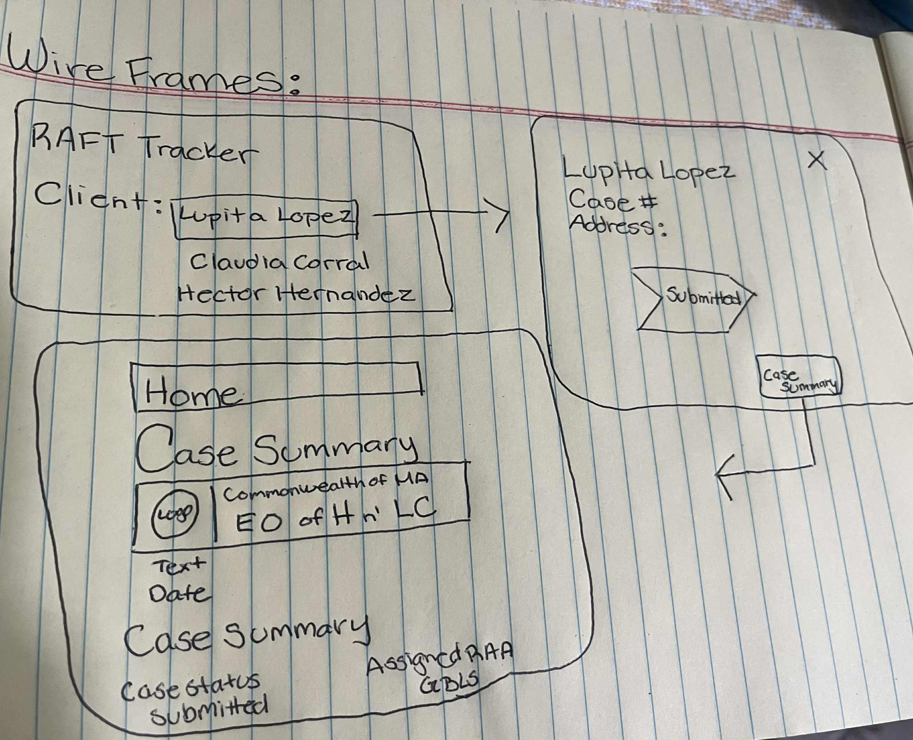
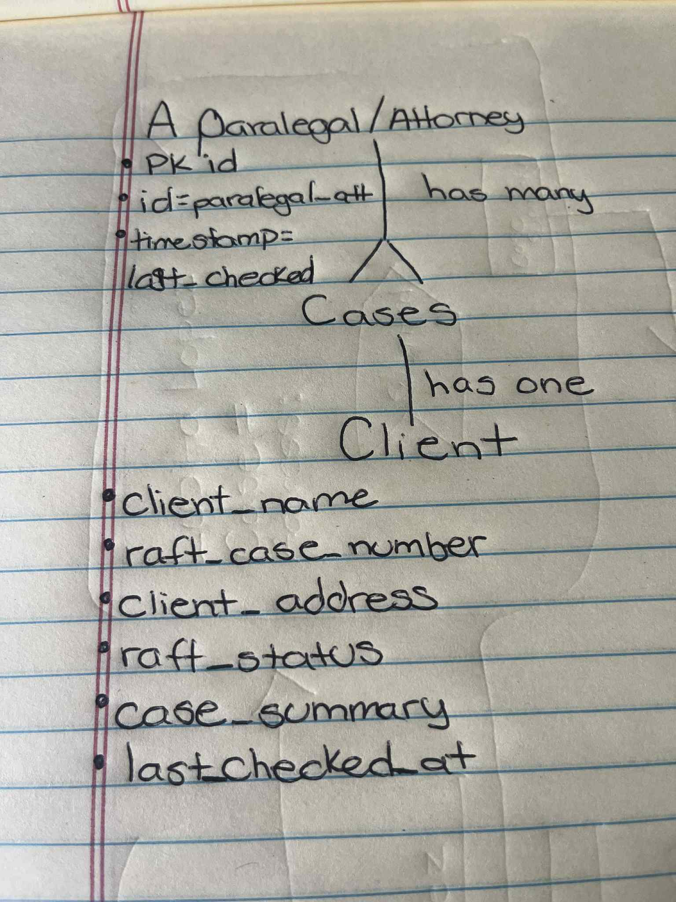

# RAFT Status Tracker — README

A lightweight tool for GBLS staff to track RAFT application status, see missing documents, and generate a one-page `Case Summary` for court/opposing counsel. This tracker does not file RAFT; RAFT is already submitted in the state portal. We only read status and organize next actions.

---

## 1) Personas

- **Paralegal (primary):** needs to see live status, missing docs, next actions, and due dates.
- **Attorney (secondary):** needs a **printable Case Summary** proving RAFT is pending/under review.

---

## 2) User Stories

### Story A — Paralegal: View Live RAFT Status
**As a** paralegal,  
**I want** to click a client’s name and see their RAFT status,  
**so that** I can act quickly (re-apply or send missing documents).

**Acceptance Criteria**
- From **Client List**, clicking a client opens **Client Detail** showing:
  - Current **RAFT Status** (e.g., Submitted, Under Review, Expired, Closed, Paid)
  - **RAFT Case #**, **Submitted Date**
  - **Last Checked** (timestamp)
- A **Re-check Status** button refreshes status & updates **Last Checked**.
- If RAFT session/login fails, show a clear **Re-authenticate** prompt.

### Story B — Attorney: One-Page Case Summary
**As an** attorney,  
**I want** a one-page **Case Summary** view,  
**so that** I can show opposing counsel/judge that RAFT is pending.

**Acceptance Criteria**
- From **Client Detail**, **View Case Summary** shows:
  - Client Name
  - RAFT Case #, Current Status, **Last Checked**
  - **Notes/Contact Log** (last 3 entries)
- **Export PDF** outputs the same content with footer:  
  “Generated on <date/time> for verification purposes.”

---

## 3) Non-Functional Requirements

- Page loads in **< 2s** on office Wi-Fi.
- **Read-only** integration to RAFT portal (no edits).
- **Audit log** for who viewed/refreshed/exported.
- **Accessibility:** keyboard-navigable, meaningful labels, visible focus.
- **Privacy:** avoid unnecessary PII (no SSN, full DOB).

---

## 4) Status & Fields (MVP)

```json
{
  "status_enum": [
    "Not Submitted",
    "Submitted",
    "Under Review",
    "Expired",
    "Ready for Payment",
    "Payed",
    "Closed"
  ],
  "doc_flags": ["ID", "Case Number", "Rental Property"]
}
```
---

## 5) Wireframes



---

## 6) Database Entity Relationship Diagram (ERD)

```sql
erDiagraml
    PARALEGAL_ATTORNEY ||--o{ MATTER : "has many"

    PARALEGAL_ATTORNEY {
      uuid id PK
      string role "paralegal|attorney"
      string name
      string email
      timestamp created_at
      timestamp updated_at
    }

    CASE {
      uuid id PK
      uuid paralegal_attorney_id FK
      string client_name
      string raft_case_number
      string client_address
      string raft_status  "Submitted|Under Review|Pending|payed|Denied|Closed"
      text   case_summary //not text, it's a pdf
      timestamp last_checked_at
    }
```


---

## 7) Technologies Used 
- Language: Python 3.10+ 
- Framework: Flask (server-rendered Jinja pages)
- Database: SQLite (dev) → PostgreSQL (prod) 
- ORM: SQLAlchemy (Declarative / SQLModel-style mappings) 
- Config: python-dotenv for .env 
- PDF Export: wkhtmltopdf via pdfkit 
- Auth (later): flask-login / OIDC (Authlib) 
- Logging/Audit (later): DB table for view/refresh/export actions 
- Deployment: single process (gunicorn) or container; env vars for secrets

---